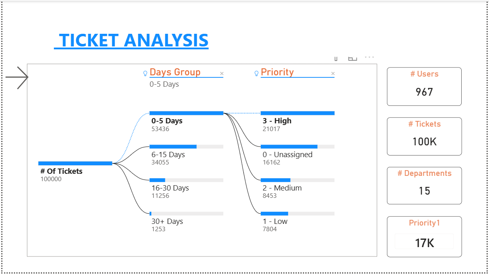
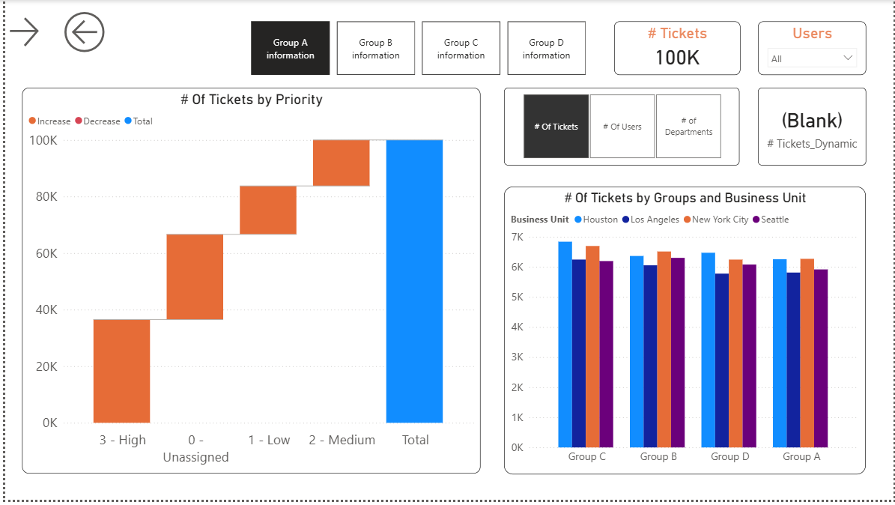
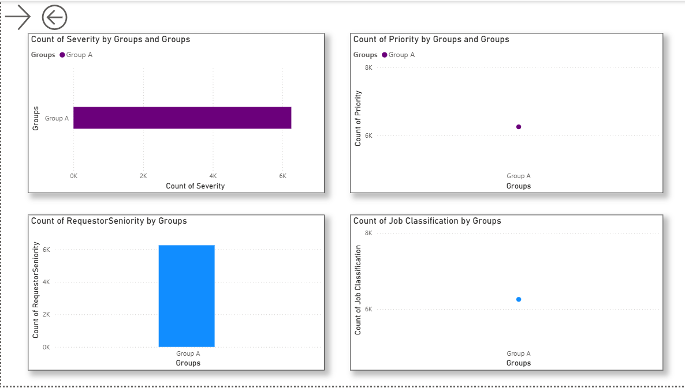
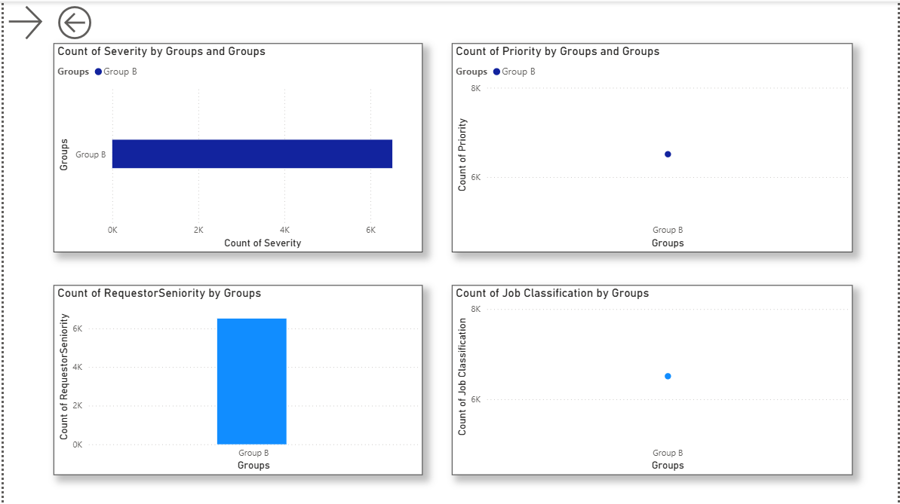
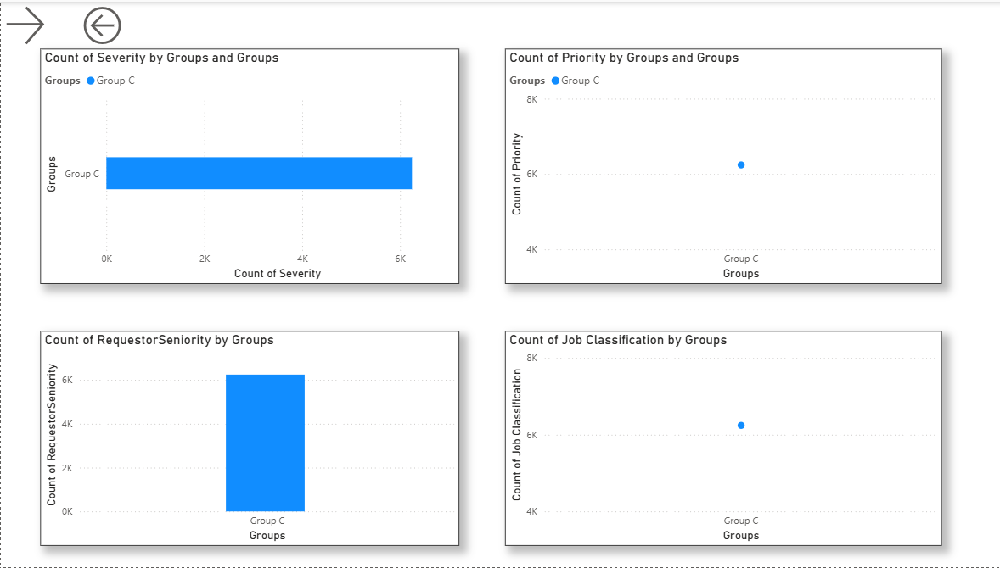
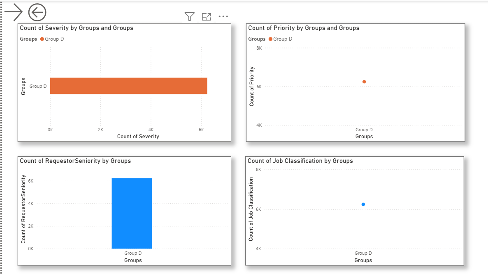

# Ticket Analysis Report

## Project Overview
Developed an interactive Ticket Analysis Report in Power BI to analyze and monitor ticket performance across multiple groups (Group A, B, C, and D).  
This project provides insights into ticket distribution, priority levels, user demographics, and overall operational performance.

## Objectives
- Analyze ticket distribution across groups  
- Monitor priority and severity trends  
- Understand user demographics  
- Improve operational efficiency  

## Key Features
-  Drill-through functionality for detailed group-level analysis  
-  Interactive visuals using Edit Interactions  
-  Bookmarks & Buttons for smooth navigation  
-  AI visuals to highlight key insights  
-  Sync slicers across multiple pages  

## Tools & Technologies
- Power BI  
- Microsoft Excel  
- DAX  

## Dashboard Visualizations
- Waterfall Charts  
- Donut Charts  
- Bar Charts  
- Scatter Plots  
- KPI Cards  

## Dashboard Screenshots & Explanation

### Overview Dashboard

This dashboard provides a high-level summary of ticket data, including total tickets, users, and departments.  
It categorizes tickets based on **Days Group (0–5, 6–15, 16–30, 30+)** and **Priority Levels**, helping to quickly understand workload distribution and urgency.

### Executive Dashboard

Displays key performance indicators (KPIs) such as total tickets and user count.  
Includes visualizations like waterfall charts and bar charts to analyze **ticket trends and group-wise performance**.

### Group A Analysis

Provides detailed insights into Group A performance, including **severity count, priority distribution, requestor seniority, and job classification**.  
Supports drill-through for deeper analysis.

### Group B Analysis

Provides detailed insights into Group B performance, including **severity count, priority distribution, requestor seniority, and job classification**.  
Supports drill-through for deeper analysis.

### Group C Analysis

Provides detailed insights into Group C performance, including **severity count, priority distribution, requestor seniority, and job classification**.  
Supports drill-through for deeper analysis.

### Group D Analysis

Provides detailed insights into Group D performance, including **severity count, priority distribution, requestor seniority, and job classification**.  
Supports drill-through for deeper analysis.

## Key Insights
- Identified high ticket volume categories  
- Analyzed priority and severity distribution  
- Evaluated group-wise performance  
- Discovered patterns in user data  

## Business Impact
- Enables data-driven decision-making  
- Improves ticket resolution efficiency  
- Provides clear performance visibility  
- Helps identify bottlenecks  

## Conclusion
This project demonstrates advanced Power BI capabilities in interactive dashboards, drill-through analysis, and data storytelling.  
It transforms raw data into meaningful insights for better operational performance.

---

